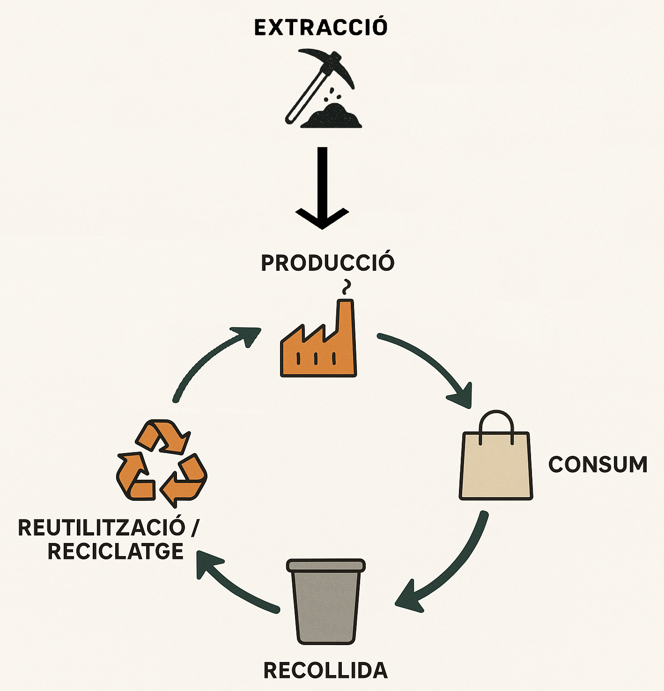

# 🌍 Google My Maps 🌍

## ℹ️ Què és Google My Maps?

**Google My Maps** és una eina en línia de Google que permet crear mapes personalitzats.  
La seva finalitat és oferir a qualsevol persona la possibilitat de representar informació sobre un mapa d’una manera clara i accessible.  
És molt útil en àmbits educatius, professionals i personals, ja que facilita la planificació d’activitats, l’explicació de conceptes i la presentació d’informació geogràfica de forma visual i entenedora.  
Amb My Maps és possible dissenyar mapes adaptats a les necessitats de cada projecte i compartir-los fàcilment amb altres persones, ja sigui mitjançant l’enllaç públic o bé incrustant-los en una web amb un `<iframe>`, clicka [aquí](https://xbaubes.github.io/modules/aplicainfo/mymaps/mymaps.html?page=Google%20My%20Maps) per veure'n un exemple.

## 📝 Què aprendrem a fer amb Google My Maps?
- Afegir punts i assignar-los **icones, colors, descripció i imatge il·lustrativa**.  
- Mostrar el **nom dels punts** directament al mapa.  
- **Traçar línies** entre punts.  
- Afegir **capes** per organitzar els punts segons categories.  
- **Mesurar distàncies** i incloure-les a les descripcions.  

👉 **Exemple de mapa:**  
[Capitals de província de Catalunya](https://www.google.com/maps/d/edit?mid=1X4KqOKo3s4OL_LOHC51D5LiTrjOOTME&usp=drive_link)

---

## 🏭 Pràctica: Economia Circular vs Economia Lineal

A partir del lloc on vius, dissenya un exemple complet i realista que mostri de manera comparativa els dos models econòmics.
Representa, d’una banda, com funciona un sistema d’economia lineal existent a la teva zona i, de l’altra, un model d’economia circular. Intenta que els punts, llocs i processos que incorporis al mapa siguin el més pròxims i reals possibles a la teva realitat quotidiana.
Utilitza noms d’empreses reals que operin al teu poble o ciutat.

1. **Crea una carpeta** al Google Drive amb el nom:  
   `MyMaps-EconomiaCircularVsEconomiaLineal-Cognom1Cognom2Nom`  
   - Configura-la com a **accessible en lectura per a tothom**.
   - **Només tu** has de tenir permisos d’edició.
   - Guarda-hi els documents a presentar: El projecte Google My Maps i un document de text.
   - **Adjunta l’enllaç de la carpeta** i fes el lliurament segons les indicacions del professorat.  

2. **Configura capes al mapa**. Crea una capa per cada tipus d'economia:
   - **Economia Lineal** : *Extracció → Producció → Consum → Disposició* 
   - **Economia Circular** :
   

   Cas pràctic complet d’Economia circular amb un exemple per cada fase:
   <blockquote>

   → **Extracció** : S'extreu liti i coltan de la mina.

   → **Producció** : Es fabrica el telèfon mòbil amb un sistema desmuntable.

   → **Consum** : El consumidor el compra i el fa servir fins que s'espatlla.

   → **Recollida** : El consumidor el lliura a un punt verd de deixalleria.

   → **Reciclatge** : Es desmunta el mòbil recuperant el liti i el coltan per fabricar la següent generació de telèfons. No tornem a la mina, tornem a la producció.

   </blockquote>

   - Opcionalment, pots afegir un model d’**Economia Híbrida** en el que el resultat del procés de reciclatge no generi la mateixa matèria prima original.

   Per cada capa centra't en una matèria primera diferent. Cal que a cada capa es mostri clarament com la matèria primera original es va transformant a cada fase.
   Pots afegir diverses fonts de matèries primeres per una producció que ho requereixi o diverses empreses de consum quan és una indústria que genera molta producció.

3. **Afegeix punts a cada capa**. A cada capa hauràs d'afegir-hi punts per representar cada una de les fases del model.

   - Els elements de l’**Economia Lineal** els representarem en color blau, alguns exemples: Mines, centres comercials, abocadors, etc.
   - Els elements de l’**Economia Circular** els representarem en color verd, alguns exemples: Botigues de segona mà, deixalleries, empreses de reciclatge, etc.
   - Hi ha elements que poden pertànyer a qualsevol de les dues economies, per exemple, les indústries de fabricació o les plataformes logístiques, ja que el seu impacte depèn de com gestionen els seus recursos i residus.
   - El **nom** de cada punt ha d'indicar a quina fase pertany.
   - Assigna **icones representatives** a cada punt.
   - Inclou una **descripció breu i una imatge representativa** a cada punt.
   - Opcionalment, pots fer que es mostri el nom dels punts directament al mapa.

5. **Traça línies de flux** per indicar la seqüència del recorregut entre punts.  

6. **Mesura la distància** de cada recorregut dissenyat i escriu-la dins la descripció de la línia.  

---

## ⚖️ Anàlisi comparativa

👉 Al document de la carpeta, afegeix-li una portada i un índex que inclogui:
- Explicació dels exemples creats amb Google My Maps, tant del model lineal com del circular.
- Una valoració detallada dels avantatges i inconvenients de l’economia circular i de la linial.
- Dificultats de la implementació de l'economia circular.
