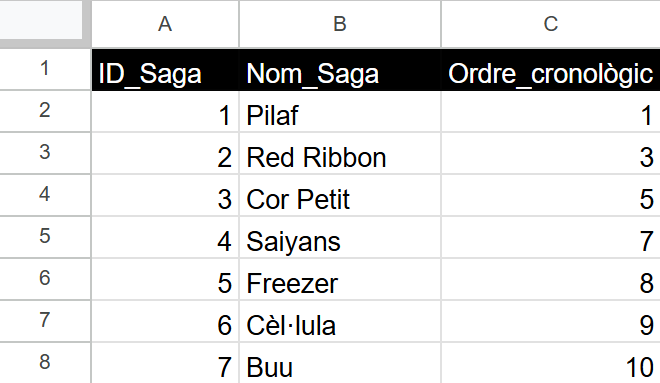
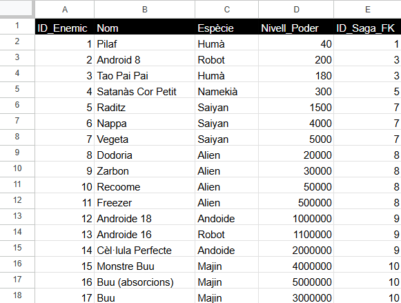
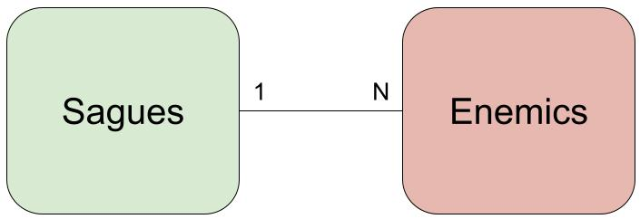
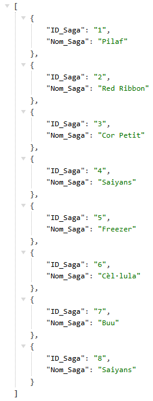

# 📊 SheetDB 📊
Convertint fulls de càlcul en una base de dades en línia  

## ℹ️ Què és SheetDB?

**SheetDB** és una tecnologia que permet convertir un **full de càlcul de Google Sheets** en una **API REST**, fent possible accedir, consultar, afegir, modificar o eliminar dades mitjançant peticions HTTP.  
Aquesta eina actua com un pont entre els fulls de càlcul i les aplicacions web, permetent treballar amb dades de manera estructurada sense necessitat de crear una base de dades tradicional.  

## 📝 Què aprendrem a fer amb SheetDB?
- Entendre com un **full de càlcul pot funcionar com una base de dades**.  
- Crear una **API REST** a partir d’un Google Sheet.  
- Fer consultes de dades mitjançant **peticions HTTP**.  
- Afegir, modificar i eliminar registres de forma remota.  
- Relacionar dades de diferents fulls com si fossin **taules d’una base de dades relacional**.

👉 **Exemple:**  
[Cercador d'elements químics](https://xbaubes.github.io/modules/aplicainfo/fullAPI/fullAPI.html?page=Full%20de%20c%C3%A0lcul%20com%20a%20API#id3)

---

## 🔌 Pràctica: Fulls de càlcul com a API

Pots utilitzar les dades que vulguis per realitzar aquesta activitat, excepte les usades com a exemple.

Documenta els resultats de l'activitat, no el procés.

**1. Dissenyar i omplir Google Sheets**

- Defineix pestanyes i columnes.
Crea almenys dues pestanyes amb informació relacionada entre elles.

| Pestanya 1 : Sagues     | Pestanya 2 : Enemics     |
|-------------------------|--------------------------|
|    |   |

- Insereix dades reals: Omple cada pestanya amb dades entrellaçades.

- Defineix una relació entre les taules: Utilitzar una clau forana permet saber a quina saga pertany cada enemic.

Relació 1:N -> Una saga té molt enemics i un enemic pertany a una sola saga

- Crea un diagrama que representi la relació que has creat.

**2. Crear compte SheetDB**

- Crear una API pel full de càlcul generat, assegura't que és d'accés públic.

- Obté la URL base de l'API: Aquesta URL permetrà consultar i modificar les dades.

**3. Defineix les crides a l'API**

Defineix i documenta les crides i comandes realitzades per tal de poder replicar-ho fàcilment.
Fes captures de pantalla de la resposta rebuda per cada crida.

- **GET** : Consulta de dades

És l'única petició HTTP que es pot realitzar des del navegador.

Obre el navegador amb la URL base per veure les dades de cada pestanya en format JSON:

Canvia la ordenació per defecte dels resultats. Per exemple, que els enemics s'ordenin per nivell de poder.

Filtra per algun camp de manera que només mostri les files que compleixin la condició. Per exemple, que només es mostrin els enemics d'una determinada saga.

- **POST** : Inserció de dades

Executarem la comanda des d'un terminal CMD.

_Comanda cURL POST genèrica:_

`curl -X POST https://sheetdb.io/api/v1/<API_ID>?sheet=<NOM_PESTANYA> -H "Content-Type: application/json" --data-binary @<RUTA_FITXER_JSON>`

- [x] `https://sheetdb.io/api/v1/<API_ID>?sheet=<NOM_PESTANYA>` → URL d’una API generada per SheetDB que permet accedir a les dades

  - <API_ID> → Identificador únic de la teva API generada per SheetDB.

  - ?sheet=<NOM_PESTANYA> → Nom de la pestanya del full de càlcul on vols inserir les dades (ex: “Enemics”).

- [x] -H "Content-Type: application/json" → Capçalera que indica que les dades enviades són en format JSON.

- [x] @<RUTA_FITXER_JSON>  → Ruta al fitxer JSON que conté les dades a afegir.

Afegeix almenys 2 files. Has de guardar les dades de la petició HTTP POST en un fitxer JSON. El [fitxer JSON](post_enemic.json) ha d'estar ben formatat.

- **PUT** : Modificació de dades

Executarem la comanda des d'un terminal CMD usant cURL.

Modifica alguna fila.

- **DELETE** : Eliminació de dades

Executarem la comanda des d'un terminal CMD usant cURL.

Elimina alguna fila.

**4.** [OPCIONAL] **Implementació web**
- Crea una petita aplicació web (HTML + JS) que consumeixi l'API creada a través dels endpoints acabats de definir.
