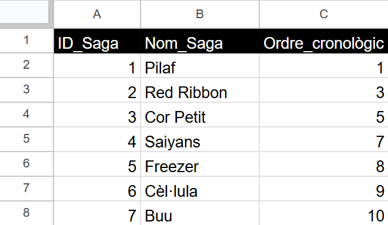
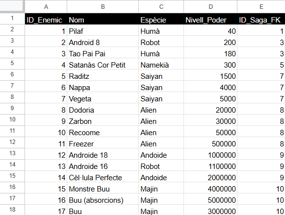
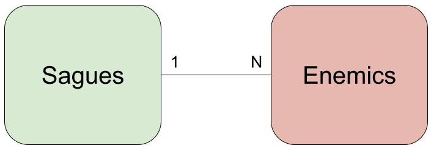
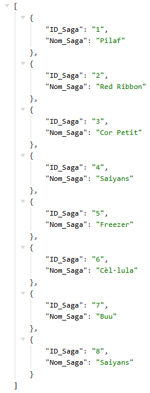

# 📊 SheetDB 📊
Convertint fulls de càlcul en una base de dades en línia  

## ℹ️ Què és SheetDB?

**SheetDB** és una tecnologia que permet convertir un **full de càlcul de Google Sheets** en una **API REST**, fent possible accedir, consultar, afegir, modificar o eliminar dades mitjançant peticions HTTP.  
Aquesta eina actua com un pont entre els fulls de càlcul i les aplicacions web, permetent treballar amb dades de manera estructurada sense necessitat de crear una base de dades tradicional.  

## 📝 Què aprendrem a fer amb SheetDB?
- Entendre com un **full de càlcul pot funcionar com una base de dades**.  
- Crear una **API REST** a partir d’un Google Sheet.  
- Fer consultes de dades mitjançant **peticions HTTP**.  
- Afegir, modificar i eliminar registres de forma remota.  
- Relacionar dades de diferents fulls com si fossin **taules d’una base de dades relacional**.

👉 **Exemple:**  
[Cercador d'elements químics](https://xbaubes.github.io/modules/aplicainfo/fullAPI/fullAPI.html?page=Full%20de%20c%C3%A0lcul%20com%20a%20API#id3)

---

## 🔌 Pràctica: Full de càlcul com a API

Per aquesta introducció a les bases de dades, utilitzarem informació del manga Bola de Drac. Ambdós conceptes es poden abreujar com a BdD; en l'idioma original, Database i Dragon Ball comparteixen l'abreviatura DB.

Pots utilitzar les dades que vulguis per realitzar aquesta activitat, excepte les usades com a exemple. 

Elabora un document on mostris els resultats de l'activitat, no el procés.


**1. Dissenyar i omplir Google Sheets**

- Defineix taules en pestanyes diferents i les seves respectives columnes.
Estableix un ID que identifiqui inequívocament cada fila de la taula.
Crea almenys dues taules amb informació relacionada entre elles.

ID_Saga_FK de la pestanya Enemics referencia a ID_Saga de la pestanya Sagues.

| Pestanya 1 : Sagues     | Pestanya 2 : Enemics     |
|-------------------------|--------------------------|
|    |   |

- Defineix una relació entre les taules: Utilitzar una clau forana permet saber a quina saga pertany cada enemic. La columna de la clau forana no ha de permetre escriure-hi qualsevol valor, només ha de permetre seleccionar entre els ID que existeixin a la columna referenciada. Fes també que les columnes ID s'omplin automàticament de forma seqüencial.

Relació 1:N -> Una saga té molt enemics i un enemic pertany a una sola saga



- Entrega:

  **a)** Un diagrama que representi la relació que has creat.

  **b)** Enllaç del full de càlcul, assegura't que és accessible per lectura. El full de càlcul ha d'estar estructurat en taules tal com s'ha explicat i ha de contenir dades reals entrellaçades entre les dos pestanyes.


**2. Crear compte SheetDB**

- Crear una API pel full de càlcul generat, assegura't que és d'accés públic.

- Obté la URL base de l'API: Aquesta URL permetrà consultar i modificar les dades.

- Entrega:

  **c)** A través de les estadístiques i gràfics de l'apartat "Details", documenta que has fet peticions GET, POST, UPDATE i DELETE.


**3. Defineix les crides a l'API**

- Defineix una col·lecció de crides per cada taula.

- Entrega:

  **d)** Documenta les crides i comandes realitzades per tal de poder replicar-ho fàcilment. Fes captures de pantalla de la resposta que l'API retorna per cada crida. Si s'escau, verifica que el full de càlcul ha sigut alterat amb la crida.

- **GET** : Consulta de dades

És l'única petició HTTP que es pot realitzar des del navegador.

Obre el navegador amb la URL base per veure les dades de cada pestanya en format JSON:



Fes almenys una petició on es canviï la ordenació per defecte dels resultats. Per exemple, que els enemics s'ordenin per nivell de poder.

Fes almenys una petició on es filtri per algun camp de manera que només mostri les files que compleixin la condició. Per exemple, que només es mostrin els enemics d'una determinada saga.

- **POST** : Inserció de dades

_Comanda cURL POST genèrica:_

```bash
curl -X POST https://sheetdb.io/api/v1/<API_ID>?sheet=<NOM_PESTANYA> -H "Content-Type: application/json" --data-binary @<RUTA_FITXER_JSON>
```

- [x] `https://sheetdb.io/api/v1/<API_ID>?sheet=<NOM_PESTANYA>` → URL d’una API generada per SheetDB que permet accedir a les dades

  - <API_ID> → Identificador únic de la teva API generada per SheetDB.

  - ?sheet=<NOM_PESTANYA> → Nom de la pestanya del full de càlcul on vols inserir les dades (ex: “Enemics”).

- [x] -H "Content-Type: application/json" → Capçalera que indica que les dades enviades són en format JSON.

- [x] @<RUTA_FITXER_JSON>  → Fitxer JSON que conté les dades a afegir amb la ruta inclosa.

Executarem la comanda des d'un terminal CMD.

Fes una petició on s'afegeixin almenys 2 files. Has de guardar les dades de la petició HTTP POST en un fitxer JSON. El [fitxer JSON](post_enemic.json) ha d'estar ben formatat.

- **PUT** : Modificació de dades

Investiga la sintaxi de la petició PUT.

Aplica a la comanda el modificador `-i`, cerca el codi d'estat retornat pel servidor HTTP:

> HTTP/1.1 200 OK
> 
> HTTP/1.1 400 Bad Request

Aquest modificador es pot aplicar a qualsevol mètode HTTP, no només a PUT.

Executarem la comanda des d'un terminal CMD usant cURL.

Fes una petició per modificar alguna fila. Mostra el resultat d'una petició amb resposta correcta i una d'incorrecta, indica el motiu de l'error.

- **DELETE** : Eliminació de dades

Investiga la sintaxi de la petició DELETE.

Executarem la comanda des d'un terminal CMD usant cURL.

Fes una petició per eliminar alguna fila.


**4.** [OPCIONAL] **Implementació web**
- Crea una petita aplicació web (HTML + CSS + JS) que consumeixi l'API, ha d'obtenir la informació que mostra a partir dels endpoints definits. Pots utilitzar Intel·ligència Artificial per confeccionar-la.
  
- Per exemple, pots fer un [gràfic](https://xbaubes.github.io/modules/aplicainfo/chart/chartjs.html?page=Chart.js) o un [mapa interactiu](https://xbaubes.github.io/modules/aplicainfo/leaflet/leafletjs.html?page=Leaflet.js).

